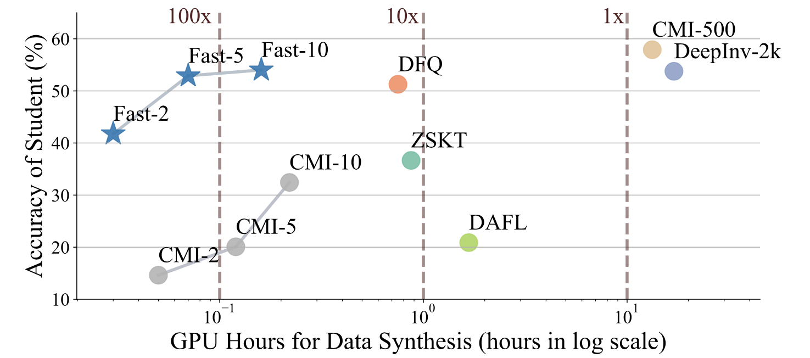

# Fast-Datafree

This repo:

* implements the efficient data-free distillation algorithm from the AAAI-22 paper 
["Up to 100x Faster Data-free Knowledge Distillation"](https://arxiv.org/pdf/2112.06253.pdf)

* (coming soon...) benchmarks a number of data-free model compression methods

<p align = "center">

</p>
<p align = "center">
Our Method Is Denoted as "Fast-X"
</p>


## Results

### CIFAR-10
| Method   | ResNet-34 <br> ResNet-18 | VGG-11 <br> ResNet-18 | WRN40-2 <br> WRN16-1 | WRN40-2 <br> WRN40-1 | WRN40-2 <br> WRN16-2 | Speed-up |
|------------|---------------------|------------------|-----------------|-----------------|-----------------|------------------|
| Teacher    | 95.70               | 92.25            | 94.87           | 94.87           | 94.87           | -                |
| Student    | 95.20               | 95.20            | 91.12           | 93.94           | 93.95           | -                |
| KD         | 95.20               | 95.20            | 95.20           | 95.20           | 95.20           | -                |
| DeepInv-2k [[7]](#7) | 93.26 (42.1h)       | 90.36 (20.2h)    | 83.04 (16.9h)   | 86.85 (21.9h)   | 89.72 (18.2h)   | 1.0x             |
| CMI-500  [[4]](#4)  | 94.84 (19.0h)       | 91.13 (11.6h)    | 90.01 (13.3h)   | 92.78 (14.1h)   | 92.52 (13.6h)   | 1.6x             |
| DAFL [[1]](#1) | 92.22 (2.73h)       | 81.10 (0.73h)    | 65.71 (1.73h)   | 81.33 (1.53h)   | 81.55 (1.60h)   | 15.7x            |
| ZSKT [[6]](#6) | 93.32 (1.67h)       | 89.46 (0.33h)    | 83.74 (0.87h)   | 86.07 (0.87h)   | 89.66 (0.87h)   | 30.4x            |
| DFQ  [[3]](#3) | 94.61 (8.79h)       | 90.84 (1.50h)    | 86.14 (0.75h)   | 91.69 (0.75h)   | 92.01 (0.75h)   | 18.9x            |
| Fast-2     | 92.62 (0.06h)       | 84.67 (0.03h)    | 88.36 (0.03h)   | 89.56 (0.03h)   | 89.68 (0.03h)   | 655.0x           |
| Fast-5     | 93.63 (0.14h)       | 89.94 (0.08h)    | 88.90 (0.08h)   | 92.04 (0.09h)   | 91.96 (0.08h)   | 247.1x           |
| Fast-10    | 94.05 (0.28h)       | 90.53 (0.15h)    | 89.29 (0.15h)   | 92.51 (0.17h)   | 92.45 (0.17h)   | 126.7x           |

### CIFAR-100
| Method     | ResNet-34 <br> ResNet-18 | VGG-11 <br> ResNet-18 | WRN40-2 <br> WRN16-1 | WRN40-2 <br> WRN40-1 | WRN40-2 <br> WRN16-2 | Speed Up |
|------------|---------------|---------------|---------------|---------------|---------------|---------|
| Teacher    | 78.05         | 71.32         | 75.83         | 75.83         | 75.83         | -       |
| Student    | 77.10         | 77.10         | 65.31         | 72.19         | 73.56         | -       |
| KD         | 77.87         | 75.07         | 64.06         | 68.58         | 70.79         | -       |
| DeepInv-2k | 61.32 (42.1h) | 54.13 (20.1h) | 53.77 (17.0h) | 61.33 (21.9h) | 61.34 (18.2h) | 1.0x    |
| CMI-500    | 77.04 (19.2h) | 70.56 (11.6h) | 57.91 (13.3h) | 68.88 (14.2h) | 68.75 (13.9h) | 1.6x    |
| DAFL       | 74.47 (2.73h) | 54.16 (0.73h) | 20.88 (1.67h) | 42.83 (1.80h) | 43.70 (1.73h) | 15.2x   |
| ZSKT       | 67.74 (1.67h) | 54.31 (0.33h) | 36.66 (0.87h) | 53.60 (0.87h) | 54.59 (0.87h) | 30.4x   |
| DFQ        | 77.01 (8.79h) | 66.21 (1.54h) | 51.27 (0.75h) | 54.43 (0.75h) | 64.79 (0.75h) | 18.8x   |
| Fast-2     | 69.76 (0.06h) | 62.83 (0.03h) | 41.77 (0.03h) | 53.15 (0.04h) | 57.08 (0.04h) | 588.2x  |
| Fast-5     | 72.82 (0.14h) | 65.28 (0.08h) | 52.90 (0.07h) | 61.80 (0.09h) | 63.83 (0.08h) | 253.1x  |
| Fast-10    | 74.34 (0.27h) | 67.44 (0.16h) | 54.02 (0.16h) | 63.91 (0.17h) | 65.12 (0.17h) | 124.7x  |

### ImageNet
| Method         | Data Amount | Syn. Time | Speed Up | ResNet-50 <br> ResNet-50 | ResNet-50 <br> ResNet-18 | ResNet-50 <br> MobileNetv2 |
|----------------|-------------|-----------|----------|-----------|-----------|-----------|
| Scratch        | 1.3M        | -         | -        | 75.45     | 68.45     | 70.01     |
| Places365+KD   | 1.8M        | -         | -        | 55.74     | 45.53     | 39.89     |
| Generative DFD [[5]](#5) | -           | ~300h     | 1x       | 69.75     | 54.66     | 43.15     |
| DeepInv-2k     | 140k        | 166h      | 1.8x     | 68.00     | -         | -         |
| Fast-50        | 140k        | 6.28h     | 47.8x    | 68.61     | 53.45     | 43.02     |

## Quick Start

### 1. Prepare the files

To reproduce our results, please download pre-trained teacher models from [Dropbox-Models (266 MB)](https://www.dropbox.com/sh/w8xehuk7debnka3/AABhoazFReE_5mMeyvb4iUWoa?dl=0) and extract them as `checkpoints/pretrained`.
Instead, you can train a model from scratch as follows.
```bash
python train_scratch.py --model wrn40_2 --dataset cifar10 --batch-size 256 --lr 0.1 --epoch 200 --gpu 0
```
   
### 2. Reproduce our results
* To get similar results of our method on CIFAR datasets, run the script in `scripts/fast_cifar.sh`. (A sample is shown below) 
  Synthesized images and logs will be saved in `checkpoints/datafree-fast_meta`.
    ```bash
    # g-steps is the number of iterations in synthesizing
    python datafree_kd.py \
    --gpu 0 \
    --seed 0 \
    --dataset cifar100 \
    --warmup 20 --epochs 220 \
    --batch_size 256 \
    --lr 0.2 \
    --kd_steps 400 --ep_steps 400 \
    --adv 1.1 --bn 10.0 --oh 0.4 \
    --act 0 --balance 0 \
    --T 20 \
    --method fast_meta --is_maml 1 \
    --g_steps 2 \
    --lr_z 0.015 --lr_g 5e-3 \
    --bn_mmt 0.9 \
    --reset_l0 1 --reset_bn 0 \
    --save_dir run/wrn-2 --log_tag wrn-2
    ```
* To calculate the generator's gradient with REPTILE, set `--is_maml 0`. 
  To disable meta learning, use `--method fast` option which updates the generator in a normal (sequential) way.
* To get the result of Vanilla KD using original training data, run the following command.
    ```bash
    # beta>0 to use hard targets
    python vanilla_kd.py --teacher wrn40_2 --student wrn16_1 --dataset cifar10 --transfer_set cifar10 --beta 0.1 --batch-size 128 --lr 0.1 --epoch 200 --gpu 0
    ```

### 3. Train your own models/datasets
You can register your models and datasets in registry.py by modifying `NORMALIZ_DICT`, `MODEL_DICT` and `get_dataset`. Then you can run the above commands to train your own models.


## Bibtex
If you found this work useful for your research, please cite our paper:
```
@misc{fang2021contrastive,
      title={Up to 100x Faster Data-free Knowledge Distillation}, 
      author={Gongfan Fang and Kanya Mo and Xinchao Wang and Jie Song and Shitao Bei and Haofei Zhang and Mingli Song},
      year={2022},
      eprint={2112.06253},
      archivePrefix={arXiv},
      primaryClass={cs.AI}
}
```

## References
<a id="1">[1]</a>
Chen, H., Wang, Y., Xu, C., Yang, Z., Liu, C., Shi, B., ... & Tian, Q. (2019). 
Data-free learning of student networks. 
In Proceedings of the IEEE/CVF International Conference on Computer Vision, 3514-3522.  

<a id="2">[2]</a>
Chen, H., Guo, T., Xu, C., Li, W., Xu, C., Xu, C., & Wang, Y. (2021). 
Learning Student Networks in the Wild. 
In Proceedings of the IEEE/CVF Conference on Computer Vision and Pattern Recognition, 6428-6437.  

<a id="3">[3]</a>
Choi, Y., Choi, J., El-Khamy, M., & Lee, J. (2020). 
Data-free network quantization with adversarial knowledge distillation. 
In Proceedings of the IEEE/CVF Conference on Computer Vision and Pattern Recognition Workshops, 710-711.  

<a id="4">[4]</a>
Fang, G., Song, J., Wang, X., Shen, C., Wang, X., & Song, M. (2021). 
Contrastive Model Inversion for Data-Free Knowledge Distillation. 
arXiv preprint arXiv:2105.08584.  

<a id="5">[5]</a>
Luo, L., Sandler, M., Lin, Z., Zhmoginov, A., & Howard, A. (2020). 
Large-scale generative data-free distillation. 
arXiv preprint arXiv:2012.05578.  

<a id="6">[6]</a>
Micaelli, P., & Storkey, A. J. (2019). 
Zero-shot knowledge transfer via adversarial belief matching. 
Advances in Neural Information Processing Systems, 32.  

<a id="7">[7]</a>
Yin, H., Molchanov, P., Alvarez, J. M., Li, Z., Mallya, A., Hoiem, D., ... & Kautz, J. (2020). 
Dreaming to distill: Data-free knowledge transfer via deepinversion. 
In Proceedings of the IEEE/CVF Conference on Computer Vision and Pattern Recognition, 8715-8724.
